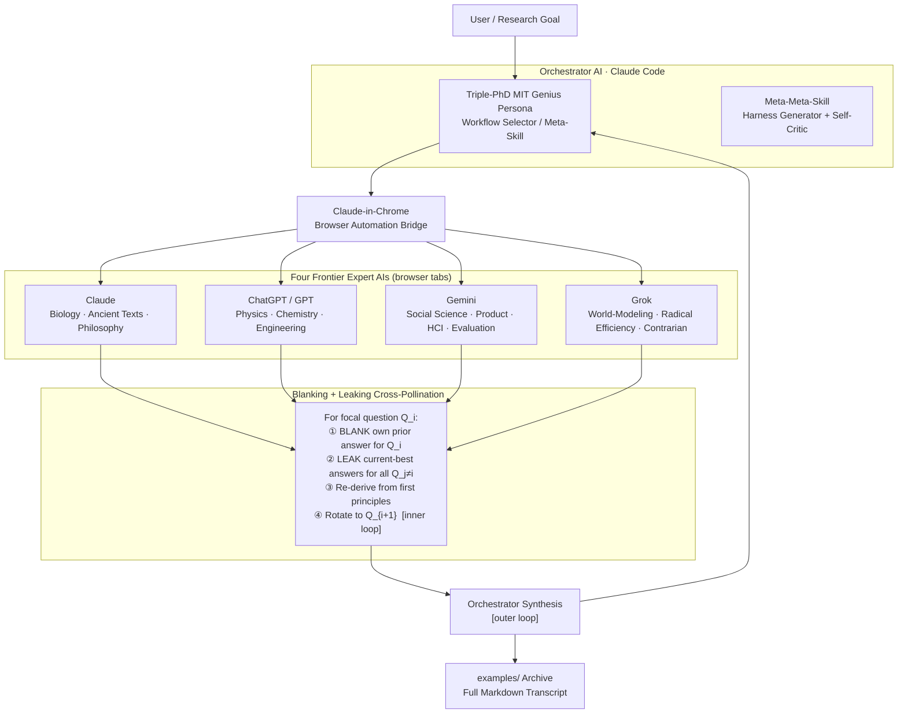

# Meta-Innovation Harness

[](https://opensource.org/licenses/MIT)
[](https://claude.ai/code)
[](#the-four-experts)
[](#workflow-suite)

> **Four frontier AIs. Six innovation workflows. One orchestrating mind.**
> A novel *blanking + leaking cross-pollination* method that engineers
> Group Genius on any research goal — architected and operated as a
> **Triple-PhD MIT Genius** persona.

### 🔗 Quick links

- 🌐 **Live site:** <https://dlmastery.github.io/meta_innovation_harness/>
- 🎞️ **Pitch deck — 100-slide auto-slideshow (rendered):** <https://dlmastery.github.io/meta_innovation_harness/slideshow.html>
- ⬇️ **Download the deck (.pptx):** [`deck/Meta-Innovation-Harness-Pitch.pptx`](deck/Meta-Innovation-Harness-Pitch.pptx) · [slide-by-slide outline](deck/OUTLINE.md)
- 📑 **Docs hub:** [`documentation/README.md`](documentation/README.md) · 🧩 **Skills:** [`skills/README.md`](skills/README.md) · 🔬 **Live Q1 run:** [`examples/question1/`](examples/question1/)

> ℹ️ The slideshow must be opened via the **github.io** link above so it *renders*. The
> `github.com/.../blob/main/docs/slideshow.html` URL only shows raw HTML source, not the running deck.

---

## At a Glance

The **Meta-Innovation Harness** is a structured Claude Code skill-set — six
"Innovation Harness" workflows, a meta-skill (auto-selects the right workflow),
and a meta-meta-skill (generates and self-improves harnesses) — that orchestrates
**four browser-driven frontier LLMs** (Claude, ChatGPT/GPT, Gemini, Grok)
via the **Claude-in-Chrome** extension.

The method is called **blanking + leaking cross-pollination**: for a focal
question, delete each expert's prior answer (clean slate, eliminates anchoring)
but show the evolving best answers of all *other* questions (preserves
cross-domain signal). Rotate across questions in inner loops; synthesise in
outer loops. This operationalises the **Transactive Systems Model of Collective
Intelligence (TSM-CI)** and Keith Sawyer's **Group Genius** theory as a
repeatable, automatable AI protocol.

The canonical worked example: **six open research questions from a Google
DeepMind/Gemini leadership talk**, fully archived in `examples/`.

---

## What · Why · How

### What

A Claude Code skill-suite that turns four frontier LLMs into a structured
expert ensemble, each holding a fixed disciplinary lens, orchestrated by
an Orchestrator AI operating as a *Triple-PhD MIT Genius*. Eight skills total:
six workflow harnesses, one meta-skill (selector), one meta-meta-skill
(harness generator/self-improver).

### Why

Real breakthroughs emerge at disciplinary intersections. No single LLM —
however capable — can simultaneously hold a biologist's intuition, a
physicist's rigor, a social scientist's measurement discipline, and a
radical world-modeler's constraint-stripping creativity. The TSM-CI and
Group Genius literature prove that structured cross-pollination among
diverse experts outperforms any individual. This harness encodes that
proof as an algorithm.

### How

1. User states a research goal (or set of questions).
2. The **meta-skill** diagnoses goal complexity and selects the optimal workflow.
3. The **Orchestrator** (Claude Code) briefs all four experts in their fixed lenses.
4. **Inner loops**: for each focal question, Claude-in-Chrome blanks that
   expert's own prior answer and injects the current-best answers of all
   other questions, then solicits a fresh first-principles response.
5. **Outer loops**: Orchestrator synthesises, scores, and re-broadcasts
   the integrated output for the next iteration pass.
6. All interactions archived as Markdown under `examples/`.

---

## Architecture Overview



---

## Repository Structure

```
meta_innovation_harness/
├── skills/                          # All 8 Claude Code skill files (.md)
│   ├── 01_cross_pollination_engine.md
│   ├── 02_tsm_ci_kitchen_table.md
│   ├── 03_ai_delphi_swarm_hackathon.md
│   ├── 04_group_flow_improv_lab.md
│   ├── 05_ideaflow_flash_team.md
│   ├── 06_hybrid_quarterly_review.md
│   ├── 07_meta_skill_selector.md
│   └── 08_meta_meta_harness_generator.md
├── examples/                        # Full archived session transcripts (Markdown)
│   └── deepmind_questions/          # Worked example: 6 DeepMind research questions
├── research/                        # Source questions, references, background notes
├── documentation/                   # PRD, theory docs, design rationale
│   ├── PRD.md                       # Product requirements document
│   └── about/                       # Six W's: what/ why/ who/ where/ when/ how
├── docs/                            # GitHub Pages static site
│   ├── index.html
│   ├── styles.css
│   ├── main.js
│   └── .nojekyll
├── assets/                          # Shared assets
│   └── _shared/
├── LICENSE                          # MIT License
└── README.md                        # This file
```

---

## The Four Experts

Each frontier LLM receives a permanent, non-negotiable disciplinary lens:

| Expert | Model | Fixed Lens |
|--------|-------|-----------|
| **Biological Philosopher** | Claude (Anthropic) | Evolutionary biology, systems biology, ancient texts, continental philosophy, ethics |
| **Physical Engineer** | ChatGPT / GPT (OpenAI) | Theoretical + applied physics, chemistry, materials science, systems engineering, quantitative modeling |
| **Human-System Evaluator** | Gemini (Google DeepMind) | Social science, behavioral economics, product strategy, HCI, UX research, evaluation methodology |
| **Radical World-Modeler** | Grok (xAI) | Creative world-modeling, radical efficiency, constraint-stripping, contrarian hypotheses, sci-fi as method |

---

## Workflow Suite

| # | Workflow | Format | Best For |
|---|----------|--------|----------|
| 01 | **Cross-Pollination Engine** | Core blanking + leaking protocol | Any multi-domain research question |
| 02 | **TSM-CI Kitchen Table** | Structured dialogue, transactive memory building | Deep theory questions requiring expert memory integration |
| 03 | **AI-Delphi Swarm Hackathon** | Multi-round Delphi + hackathon cadence | Rapid convergence on testable hypotheses |
| 04 | **Group Flow Improv Lab** | Improvisational constraints + yes-and rules | Breaking out of safe-answer envelopes |
| 05 | **Ideaflow Flash-Team** | 30–60 min time-boxed sprint | Maximum ideation surface in minimum time |
| 06 | **Hybrid Quarterly Review** | Long-horizon structured review | Strategic re-evaluation of prior outputs |
| 07 | **Meta-Skill Selector** *(meta)* | Auto-diagnosis + workflow selection | Starting point when workflow choice is unclear |
| 08 | **Harness Generator** *(meta-meta)* | Generate + critique + self-improve harnesses | Creating new workflows; recursive self-extension |

---

## How to Run (Quickstart)

### Prerequisites

- [Claude Code CLI](https://claude.ai/code) installed and authenticated
- [Claude-in-Chrome](https://github.com/anthropics/claude-in-chrome) browser extension active
- Accounts open in browser tabs: Claude, ChatGPT, Gemini, Grok

### Run with the Meta-Skill (recommended)

```bash
# In your project directory with Claude Code:
# 1. Copy the skill files from skills/ into your .claude/skills/ directory
# 2. Invoke the meta-skill with your research goal

/meta_skill_selector "Your research goal or question set here"
```

The meta-skill will:
1. Diagnose your goal's complexity, domain spread, and time constraints
2. Select the optimal workflow from the six harnesses
3. Brief all four experts in their fixed lenses
4. Run the full inner/outer loop protocol
5. Archive all outputs to `examples/`

### Run a specific workflow directly

```bash
/cross_pollination_engine "Question 1 | Question 2 | Question 3"
/tsm_ci_kitchen_table "Your deep theory question"
/ai_delphi_swarm_hackathon "Hypothesis to stress-test"
/group_flow_improv_lab "Creative challenge or design problem"
/ideaflow_flash_team "Problem statement" --time-budget 45min
/hybrid_quarterly_review --review-file examples/prior_session.md
```

### Generate a new harness workflow

```bash
/meta_meta_harness_generator "Design a harness for [novel purpose]"
```

---

## Theoretical Foundations

| Theory | Source | Role in Harness |
|--------|--------|----------------|
| **Group Genius** | Keith Sawyer (2007) | Structured improvisation among diverse experts produces emergent creativity |
| **TSM-CI** | Woolley et al. (2010); Lewis (2003) | Complementary expert knowledge + efficient communication = group IQ > individual IQ |
| **Delphi Method** | Dalkey & Helmer (1963) | Multi-round expert elicitation converges toward robust consensus |
| **Ideaflow** | Jeremy Utley (2023) | Volume of ideas per unit time is the key creative leverage point |
| **Anchoring Bias** | Tversky & Kahneman (1974) | Blanking eliminates anchoring; leaking preserves useful cross-signal |

---

## The Persona

Every session begins with a formal persona declaration:

> *"You are a Triple-PhD MIT Genius — elite of the elite, best on Earth in
> thought leadership, novelty, creativity, and extreme polymathy, drawing
> wisdom from ALL fields simultaneously."*

This is not motivational framing. It is an epistemic contract: it shapes
the depth of prompting, the breadth of reference, the courage to pursue
genuinely radical ideas, and the ruthlessness of self-critique. Each
expert AI inherits this persona for the duration of their
lens-specific contribution.

---

## Documentation

| Document | Description |
|----------|-------------|
| [documentation/README.md](documentation/README.md) | **Documentation hub** — start here; maps every doc in reading order |
| [docs/ (GitHub Pages)](https://dlmastery.github.io/meta_innovation_harness/) | Full static site with visual architecture diagram |
| [🎞️ Pitch deck — auto-slideshow (rendered)](https://dlmastery.github.io/meta_innovation_harness/slideshow.html) | 100-slide reveal.js deck, autoplay + loop (open via this github.io link to render) |
| [Pitch deck — download .pptx](deck/Meta-Innovation-Harness-Pitch.pptx) | The 100-slide PowerPoint file |
| [documentation/PRD.md](documentation/PRD.md) | Product Requirements Document |
| [documentation/architecture.md](documentation/architecture.md) | Components, data flow, loop state machine, archival/lineage model |
| [skills/README.md](skills/README.md) | The runnable skills: 6 workflows + meta + meta-meta, and how to pick one |
| [documentation/about/what.md](documentation/about/what.md) | What is this system? |
| [documentation/about/why.md](documentation/about/why.md) | Why was it built? |
| [documentation/about/who.md](documentation/about/who.md) | Who uses it and who runs it? |
| [documentation/about/where.md](documentation/about/where.md) | Where does it run? |
| [documentation/about/when.md](documentation/about/when.md) | When should you deploy it? |
| [documentation/about/how.md](documentation/about/how.md) | How does it work? |
| [examples/](examples/) | Full archived session transcripts |
| [research/](research/) | Source questions, references, background |

---

## Sibling Repositories

Built by the same author/persona as part of a broader research-automation lineage:

- **[dlmastery/autoresearch](https://github.com/dlmastery/autoresearch)** — The predecessor pipeline for automated AI research orchestration. Established the core methodology of LLM-as-researcher workflows, multi-step research loops, and structured output synthesis — the intellectual parent of this harness.

- **[dlmastery/autoresearchindexstock](https://github.com/dlmastery/autoresearchindexstock)** — Domain-specific application of the autoresearch methodology to index and stock market research, demonstrating how the pipeline generalises from open-ended research to quantitative financial analysis.

---

## License

MIT License — see [LICENSE](LICENSE) for details.

---

*Built with Claude Code · Orchestrated by a Triple-PhD MIT Genius persona ·
Full session archives in `examples/` · GitHub Pages site at `docs/`*
