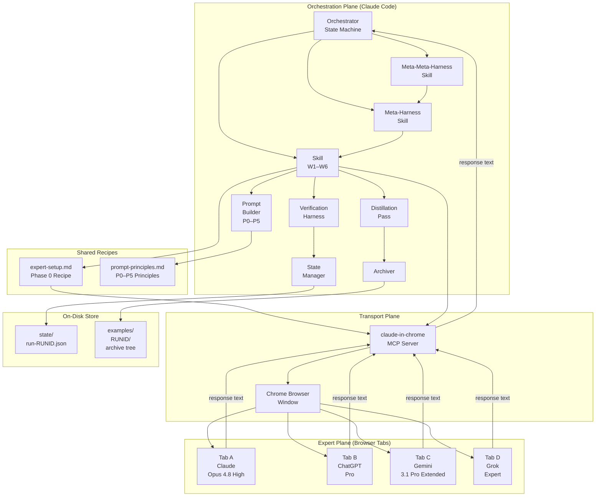
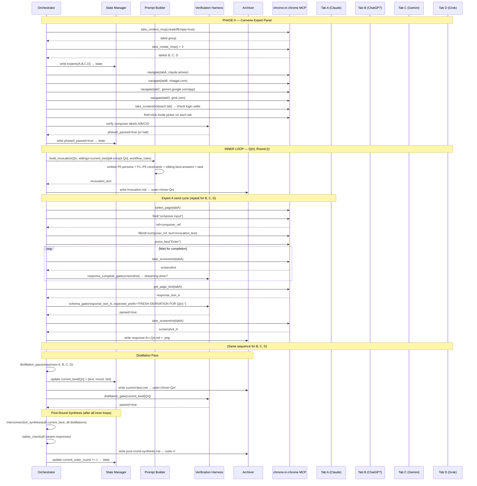
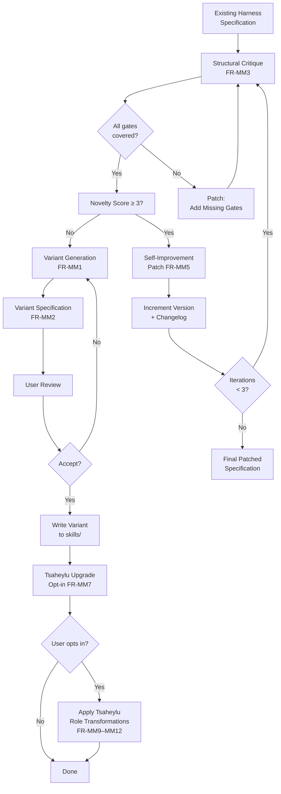

# Meta-Innovation Harness — Architecture Document

**Version:** 1.0  
**Date:** 2026-05-30  
**Status:** Canonical  
**Classification:** Public (repo root)

---

## Table of Contents

1. [Architectural Overview](#1-architectural-overview)
2. [Component Diagram](#2-component-diagram)
3. [Inner/Outer Loop State Machine](#3-innerouter-loop-state-machine)
4. [Orchestrator–Expert Data Flow](#4-orchestratorexpert-data-flow)
5. [Transport Layer Architecture](#5-transport-layer-architecture)
6. [State and Memory Model](#6-state-and-memory-model)
7. [Archival and Lineage Model](#7-archival-and-lineage-model)
8. [Workflow Variant Architecture](#8-workflow-variant-architecture)
9. [Meta-Harness Architecture](#9-meta-harness-architecture)
10. [Meta-Meta-Harness Architecture](#10-meta-meta-harness-architecture)
11. [Verification Harness Architecture](#11-verification-harness-architecture)
12. [Failure Domain Isolation](#12-failure-domain-isolation)
13. [Concurrency and Serialisation Model](#13-concurrency-and-serialisation-model)
14. [Key Design Decisions and Rationale](#14-key-design-decisions-and-rationale)

---

## 1. Architectural Overview

The Meta-Innovation Harness is a **single-process orchestration system** running inside a Claude Code session on the operator's machine. It drives four remote browser-based LLM services through the Claude-in-Chrome MCP toolkit. The system is intentionally **serial at the expert level** (one expert tab is active at a time) and **sequential at the loop level** (inner loops are not parallelised), because:

1. Each inner loop builds on the others' `current_best` outputs — a dependency that rules out true parallelism.
2. Tab-level hover/menu interactions require the target tab to be in the foreground, making tab switching a serialised resource.
3. The archive is a per-step sequential ledger; concurrent writes would corrupt lineage.

The architecture has three execution planes:

| Plane | Components | Role |
|-------|-----------|------|
| **Orchestration plane** | Claude Code session, skill files, state machine | Drives the entire run; enforces all gates; manages state |
| **Transport plane** | claude-in-chrome MCP server, Chrome browser | Bridges Orchestrator commands to expert tabs |
| **Expert plane** | Claude.ai, ChatGPT, Gemini, Grok tabs | Produces the research outputs (responses) |

These planes are fully separated by explicit interfaces: the Orchestration plane never touches the browser directly; all browser actions go through MCP tool calls. The Expert plane never sees the Orchestrator's logic; it only sees the invocation text.

---

## 2. Component Diagram



### Component Responsibilities

| Component | Responsibilities |
|-----------|----------------|
| **Orchestrator State Machine** | Entry point for every run; drives the outer-round loop; calls Skills; enforces top-level gates |
| **Skill W1–W6** | Encodes workflow-specific round structure, per-expert invocation rules, and output templates |
| **Meta-Harness Skill** | Goal decomposition; workflow selection; calls selected Skill |
| **Meta-Meta-Harness Skill** | Variant generation; critique; self-improvement; Tsaheylu upgrade management |
| **Verification Harness** | Evaluates gate conditions; logs pass/fail; surfaces failures to user |
| **State Manager** | Atomic reads/writes to `run-{RUNID}.json`; provides resume capability |
| **Archiver** | Writes invocations, responses, screenshots, current-best, and synthesis to the archive tree |
| **Prompt Builder** | Assembles the canonical invocation template with P0–P5 constraints, sibling best-answers, and task directive |
| **Distillation Pass** | Selects or synthesises the Current Best from 4 expert variants |
| **expert-setup.md** | Shared Phase 0 procedure: tab creation, navigation, mode setting, mode verification |
| **prompt-principles.md** | Canonical P0–P5 principles and invocation template |
| **claude-in-chrome MCP** | Bridges tool calls to Chrome via CDP; manages tab handles |
| **Chrome Browser** | Hosts the 4 expert tabs in one window |
| **Expert Tabs (A/B/C/D)** | Real authenticated sessions at the four frontier LLM services |

---

## 3. Inner/Outer Loop State Machine

```mermaid
stateDiagram-v2
    [*] --> INIT : run started

    INIT --> PHASE0 : state file created

    PHASE0 --> PHASE0_FAILED : any expert mode gate fails (after 2 retries)
    PHASE0_FAILED --> PHASE0 : user fixes and confirms
    PHASE0 --> OUTER_ROUND : phase0_passed = true

    state OUTER_ROUND {
        [*] --> SELECT_FOCAL : randomise question order
        SELECT_FOCAL --> BLANK_FOCAL : 1–3 questions selected for blanking
        BLANK_FOCAL --> COMPOSE_INVOCATION : delete current_best for focal Qs; prepare sibling context
        COMPOSE_INVOCATION --> SEND_EXPERT_A : invocation ready

        state SEND_EXPERT_A {
            [*] --> NAVIGATE_A : activate Tab A
            NAVIGATE_A --> FILL_SEND_A : find composer; fill; Enter
            FILL_SEND_A --> WAIT_COMPLETE_A : response-complete gate
            WAIT_COMPLETE_A --> READ_A : streaming done
            READ_A --> SCHEMA_CHECK_A : check "FRESH DERIVATION FOR Qn:"
            SCHEMA_CHECK_A --> ARCHIVE_A : schema passes
            SCHEMA_CHECK_A --> RETRY_A : schema fails (1st attempt)
            RETRY_A --> SCHEMA_CHECK_A : retry send
            ARCHIVE_A --> [*]
        }

        SEND_EXPERT_A --> SEND_EXPERT_B
        SEND_EXPERT_B --> SEND_EXPERT_C
        SEND_EXPERT_C --> SEND_EXPERT_D

        SEND_EXPERT_D --> DISTILLATION : all 4 variants collected
        DISTILLATION --> DISTILLATION_GATE : select Current Best
        DISTILLATION_GATE --> UPDATE_STATE : current_best[Qn] set
        UPDATE_STATE --> NEXT_INNER_LOOP : more questions remain?

        NEXT_INNER_LOOP --> SELECT_FOCAL : yes
        NEXT_INNER_LOOP --> POST_ROUND_SYNTHESIS : no (all Qs done)

        POST_ROUND_SYNTHESIS --> SAFETY_CHECK : interconnection synthesis logged
        SAFETY_CHECK --> ROUND_COMPLETE
    }

    OUTER_ROUND --> MORE_ROUNDS : round < max_rounds
    MORE_ROUNDS --> OUTER_ROUND : yes
    MORE_ROUNDS --> FINAL_CONVERGENCE : no

    FINAL_CONVERGENCE --> FINAL_CONVERGENCE_SEND : feed all current_best to all experts
    FINAL_CONVERGENCE_SEND --> REPORT_GENERATION : all 4 experts respond
    REPORT_GENERATION --> COMPLETE : final-report.md written; gate-log.json written
    COMPLETE --> [*]

    PHASE0 --> PAUSED_LOGIN : login wall detected
    OUTER_ROUND --> PAUSED_LOGIN : login wall detected mid-run
    PAUSED_LOGIN --> PHASE0 : user logs in (Phase 0 restart)
    PAUSED_LOGIN --> OUTER_ROUND : user logs in (mid-run resume)

    OUTER_ROUND --> PAUSED_TIMEOUT : expert response timeout (10 min)
    PAUSED_TIMEOUT --> OUTER_ROUND : user instructs resume/skip/abort
```

### State Transition Notes

- **BLANK_FOCAL** is a pure in-memory operation: it deletes `current_best[Qn]` from the in-memory invocation context but does NOT modify the archive. Prior archive entries are always preserved.
- **DISTILLATION_GATE** checks that `current_best[Qn]` is a non-empty string of > 100 characters. If it fails (all 4 responses were rejected or timed out), the Orchestrator surfaces the failure and awaits user instruction.
- **POST_ROUND_SYNTHESIS** is a fixed Orchestrator step, not an expert step — it runs without sending to any expert tab.
- **SAFETY_CHECK** is the Orchestrator's own analysis step: it scans all 4 variants for overconfident or ungrounded claims and logs findings.
- The state machine is identical in structure for all six workflows; workflow-specific variation lives in the per-expert invocation rules and post-round actions.

---

## 4. Orchestrator–Expert Data Flow



### Data Flow Invariants

1. **One-directional data push to experts.** The Orchestrator pushes invocation text to each expert. Expert responses come back through `get_page_text`. There is no polling loop that pulls partial results — only post-completion reads.

2. **Sibling data travels through the Orchestrator, not through the expert tabs.** Expert B does not read from Expert A's tab. All information sharing is mediated by the Orchestrator embedding `current_best` text into the next invocation.

3. **The archive is the ground truth.** If the Orchestrator restarts, it reconstructs `current_best` from the most recent `current-best.md` files in the archive tree.

4. **Screenshots are audit evidence, not input.** Screenshots are taken to verify state and provide the user with visual confirmation; they are not parsed for response text.

---

## 5. Transport Layer Architecture

### 5.1 MCP Tool Map

The following MCP tools are used by the Orchestrator. Listed in order of frequency of use:

| Tool | Purpose | Primary Lesson Applied |
|------|---------|----------------------|
| `mcp__claude-in-chrome__tabs_context_mcp` | Get/create tab group | Phase 0 entry |
| `mcp__claude-in-chrome__tabs_create_mcp` | Create a new tab | Phase 0: create 3 additional tabs |
| `mcp__claude-in-chrome__navigate` | Navigate tab to URL | Phase 0 navigation; never used mid-run for non-approved URLs |
| `mcp__claude-in-chrome__select_page` | Bring tab to foreground | Before every hover/menu interaction (L3) |
| `mcp__claude-in-chrome__find` | Locate element by label | Preferred over coordinates (L1) |
| `mcp__claude-in-chrome__computer` | Click by ref | After find returns a stable ref |
| `mcp__claude-in-chrome__hover` | Hover without clicking | Gemini Thinking Level submenu (L2) |
| `mcp__claude-in-chrome__fill` | Fill composer with text | Short prompts |
| `mcp__claude-in-chrome__type_text` | Type text into composer | Long prompts (> 2 000 chars) |
| `mcp__claude-in-chrome__press_key` | Send key event | Submit prompt with Enter |
| `mcp__claude-in-chrome__take_screenshot` | Capture tab state | Completion checks; audit screenshots |
| `mcp__claude-in-chrome__get_page_text` | Extract page text | Read expert responses |
| `mcp__claude-in-chrome__handle_dialog` | Dismiss browser dialogs | Onboarding popups (L4) |

### 5.2 Tab Lifecycle

```
CREATED → NAVIGATED → CONFIGURED (mode set) → VERIFIED (mode confirmed)
    → ACTIVE (current foreground tab)
    → IN USE (invocation sent, awaiting response)
    → RESPONSE COMPLETE (text extracted, screenshot taken)
    → IDLE (waiting for next inner loop)
    → [repeats ACTIVE through IDLE for each inner loop]
    → SESSION END (tab remains open; not closed by Orchestrator)
```

The Orchestrator tracks which tab is currently `ACTIVE` to ensure only one tab is in the foreground at a time for menu interactions.

### 5.3 Per-Expert Interaction Sequence Detail

Each expert send cycle within an inner loop follows this exact sequence:

```
1. select_page(tabX)              # L3: bring to foreground
2. handle_dialog() if needed       # L4: dismiss popups
3. find("composer input area")     # L1: get stable ref
4. fill(ref, invocation) OR
   type_text(invocation)           # FR-T9/FR-T10
5. press_key("Enter")             # submit
6. [wait loop]:
   take_screenshot(tabX)
   check: streaming_complete(screenshot)
   if not: wait 5s, repeat
   if timeout (10m): FR-T12 halt
7. get_page_text(tabX)            # FR-T15
8. schema_gate(text)              # FR-P9
9. if fail: resend with reminder  # FR-F4 (once)
10. take_screenshot(tabX)         # FR-T14: audit screenshot
11. archive(response, screenshot)
```

### 5.4 Gemini-Specific Interaction Detail

Gemini requires special handling due to its hover-submenu pattern:

```
1. select_page(tabC)              # L3
2. handle_dialog("Get started" or "Not now")  # L4
3. find("Pro ⌄" or model picker trigger)      # L1
4. computer(ref=picker_ref)        # L5: open once
5. find("3.1 Pro") → computer(ref) # select model
6. find("Thinking level") → hover(ref)  # L2: hover, do NOT click
7. find("Extended") → computer(ref)     # click in submenu
8. take_screenshot → verify "Pro" + "Extended" in composer label
```

If the picker closes unexpectedly (because the tab was not in foreground — L3 violation), the sequence restarts from step 1.

---

## 6. State and Memory Model

### 6.1 Memory Hierarchy

The system uses three tiers of memory, with clearly defined read/write rules:

| Tier | Storage | Lifetime | Access Pattern |
|------|---------|---------|----------------|
| **In-process (ephemeral)** | Orchestrator's working context | Current step only | Read/write; lost on restart |
| **State file** | `state/run-{RUNID}.json` | Full run lifetime | Persistent; atomic writes; source of truth for resume |
| **Archive** | `examples/{RUNID}/` tree | Permanent | Write-only during run; read only for resume/reconstruction |

### 6.2 Current Best Buffer

The `current_best` map is the central data structure of the blanking+leaking engine:

```
current_best: {
    "Q1": { "text": "...", "round": 2, "slot": "A" },
    "Q2": { "text": "...", "round": 2, "slot": "D" },
    ...
    "Qn": { "text": "...", "round": 1, "slot": "B" }
}
```

**Write rule:** After every distillation pass for inner loop Qi, `current_best["Qi"]` is updated.

**Read rule:** When composing an invocation for focal question Qj, read `current_best["Qi"]` for all i ≠ j. The value for Qj is NOT read (it is blanked — treated as if it does not exist for this invocation).

**Blanking semantics:** Blanking does NOT delete the `current_best` record from the state file or the archive. It only means the invocation for the focal question does NOT include a "Q{j} Current Best: …" section. The prior best is preserved for after the inner loop completes (in case no new best is selected).

**Override rule:** After distillation, if the new distillation selects a different current best for Qj, it overwrites `current_best["Qj"]`. If the distillation pass finds that no new response is an improvement, the previous current best is retained unchanged.

### 6.3 Workflow-Specific State Extensions

| Workflow | Additional State |
|----------|-----------------|
| W2 (TSM-CI) | `tms: {Qn: {strongest_expert, key_insight}}` |
| W3 (Delphi) | `organizer_rotation_index`, `bridge_questions_log[]` |
| W5 (Flash) | `owners: {Qn: slot}`, `grounding_tasks[]` |
| W6 (Review) | `leadership_pulses[]`, `phase: "phase1" | "phase2"` |
| Tsaheylu | `tsaheylu_active`, `tsaheylu_feasibility_failures` |

### 6.4 Resume Reconstruction

On Orchestrator restart, the State Manager:

1. Reads `state/run-{RUNID}.json`.
2. Reads `current_outer_round` and `current_inner_loop_qn`.
3. Reconstructs `current_best` from the most recent `current-best.md` files in the archive (one per question, latest round).
4. Verifies gate log to confirm which gates have already passed.
5. Resumes from the state after the last completed inner loop.

If the state file is missing or corrupt, the State Manager scans `outer-loop-*/inner-loop-Q*/current-best.md` files to reconstruct `current_best` from the archive.

---

## 7. Archival and Lineage Model

### 7.1 Directory Tree

```
examples/
└── {RUNID}/                          # e.g. 20260530-W2-gemini-deepmind/
    ├── state/
    │   └── run-{RUNID}.json          # live state file
    ├── outer-loop-01/
    │   ├── inner-loop-Q1/
    │   │   ├── invocation.md         # verbatim invocation text
    │   │   ├── response-A-01-Q1.md   # Claude raw response
    │   │   ├── response-A-01-Q1.png  # Claude tab screenshot
    │   │   ├── response-B-01-Q1.md
    │   │   ├── response-B-01-Q1.png
    │   │   ├── response-C-01-Q1.md
    │   │   ├── response-C-01-Q1.png
    │   │   ├── response-D-01-Q1.md
    │   │   ├── response-D-01-Q1.png
    │   │   └── current-best.md       # selected best + distillation note
    │   ├── inner-loop-Q2/
    │   │   └── ... (same pattern)
    │   ├── inner-loop-Q3/
    │   │   └── ...
    │   ├── inner-loop-Q4/
    │   │   └── ...
    │   ├── inner-loop-Q5/
    │   │   └── ...
    │   ├── inner-loop-Q6/
    │   │   └── ...
    │   └── post-round-synthesis.md
    ├── outer-loop-02/
    │   └── ... (same structure)
    ├── outer-loop-03/
    │   └── ...
    ├── outer-loop-04/
    │   └── ...
    ├── final-convergence/
    │   ├── invocation.md
    │   ├── response-A.md
    │   ├── response-A.png
    │   ├── response-B.md
    │   ├── response-B.png
    │   ├── response-C.md
    │   ├── response-C.png
    │   ├── response-D.md
    │   └── response-D.png
    ├── final-report.md               # full run report
    └── gate-log.json                 # complete gate audit trail
```

### 7.2 File Contents

**`invocation.md`** — written before sending to any expert:
```markdown
# Invocation — Outer Round {RR} • Inner Loop Q{n}
**Run:** {RUNID}
**Timestamp:** {ISO8601}
**Workflow:** {W1–W6}
**Focal Question(s):** Q{n} [blanked], Q{m} [blanked if >1]
**Sibling Context:**
Q1 Current Best (Round {r}): {text}
Q2 Current Best (Round {r}): {text}
...
[Qn NOT included — blanked]
...
**Invocation Text (verbatim, sent to all 4 experts):**
---
{full invocation text including P0, P1–P5, task directive}
```

**`response-{slot}-{RR}-{QN}.md`** — written after reading each expert:
```markdown
# Response — Slot {A/B/C/D} • Round {RR} • Q{n}
**Expert:** {Claude | ChatGPT | Gemini | Grok}
**Mode:** {Opus 4.8 High | Pro | 3.1 Pro Extended | Expert}
**Run:** {RUNID}
**Timestamp:** {ISO8601}
**Schema Gate:** {passed | failed}
---
{verbatim response text}
```

**`current-best.md`** — written after distillation:
```markdown
# Current Best — Round {RR} • Q{n}
**Selected From:** {slot A/B/C/D | synthesised from A+C}
**Run:** {RUNID}
**Timestamp:** {ISO8601}
**Key New Insight (distillation note):**
{1–3 sentence summary of the strongest new idea or cross-link}
---
{full current best text}
```

**`post-round-synthesis.md`** — written after all inner loops in a round:
```markdown
# Post-Round Synthesis — Outer Round {RR}
**Run:** {RUNID}
**Timestamp:** {ISO8601}
**Interconnection Synthesis:**
{The single most powerful new link between any two questions that emerged this round}
**Safety Check:**
{Any claims flagged as over-confident or ungrounded, with brief justification}
**Round Summary:**
{2–3 sentences on the state of the research after this round}
```

### 7.3 Lineage Traceability

Every `current-best.md` file records the slot that produced it and the round. This creates a full lineage chain:

```
Q1 Round 4 Current Best
  ← selected from Slot A response (response-A-04-Q1.md)
  ← which was generated with invocation embedding:
      Q2 Round 3 Current Best (from current-best.md in outer-03/inner-Q2/)
      Q3 Round 3 Current Best
      Q4 Round 3 Current Best
      Q5 Round 3 Current Best
      Q6 Round 3 Current Best
```

This lineage is fully reconstructable from the archive without the state file, because every `invocation.md` contains the sibling best-answers verbatim.

### 7.4 Naming Conventions

| Entity | Pattern | Example |
|--------|---------|---------|
| Run ID | `{YYYYMMDD}-{workflow}-{slug}` | `20260530-W2-gemini-deepmind` |
| Outer round dir | `outer-loop-{RR}` (zero-padded 2 digits) | `outer-loop-01` |
| Inner loop dir | `inner-loop-Q{n}` | `inner-loop-Q3` |
| Response file | `response-{slot}-{RR}-{QN}.{md|png}` | `response-A-02-Q4.md` |
| State file | `run-{RUNID}.json` | `run-20260530-W2-gemini-deepmind.json` |

---

## 8. Workflow Variant Architecture

All six workflow skills share the same underlying Orchestrator state machine (Section 3). They differ in **configuration parameters** passed to the state machine:

| Parameter | W1 | W2 | W3 | W4 | W5 | W6 |
|-----------|-----|-----|-----|-----|-----|-----|
| Outer rounds | 4 | 4 | 5 | 3 | 4 | 3+1 |
| Blanked per inner loop | 1–3 (random) | 2 (fixed) | 2 (fixed) | 1–3 (random) | 2 (fixed) | 2 (fixed) |
| Organizer role | None | None | Rotating (1 per round) | None | None | Leadership Critic (Phase 2) |
| Collaboration rules | None | Yes-and + TAS + TRS | Bridge questions | Yes-and + 3 Wilds | Input obsession + grounding | Bottom-up + adversarial |
| Per-expert word budget | None | 400 | 380 | 380 | 390 | None |
| TMS tracker | No | Yes | No | No | No | No |
| Owner tracking | No | No | No | No | Yes | No |
| Phase structure | Flat | Flat | Flat | Flat | Flat | Two-phase |
| Schema prefix | `FRESH DERIVATION FOR Q{n}:` | `Yes-and… + FRESH DERIVATION FOR Q{n}:` | `Fresh Delphi answer for Q{n}:` | `Yes-and… ` | `Sprint answer for Q{n}:` | `FRESH DERIVATION FOR Q{n}:` |

The state machine accepts these parameters from the Skill file and applies them uniformly. Adding a new workflow is a matter of writing a new Skill file with the appropriate parameter values and any workflow-specific sub-steps (e.g., the Organizer sub-role invocation in W3).

### 8.1 Skill File Structure

Each workflow skill file follows this canonical structure:

```
skills/
└── {workflow-name}/
    ├── skill.md          # metadata: name, purpose, when-to-use, parameters
    ├── orchestrator.md   # Orchestrator persona + round structure specification
    ├── invocation.md     # Per-expert invocation template (extends canonical)
    ├── verification.md   # Workflow-specific gates (extending base gates)
    └── output.md         # Output schema and final report template
```

---

## 9. Meta-Harness Architecture

### 9.1 Goal Decomposition Pipeline


### 9.2 Decomposition Constraints

The Orchestrator's decomposition draft satisfies:

1. **Necessity:** Every sub-question must be essential — removing it would leave a gap in addressing the GOAL.
2. **Interdependence:** Every pair of sub-questions must have at least a weak coupling (answering one gives context for another).
3. **Non-overlap:** No two sub-questions ask essentially the same thing from different angles. If overlap is detected, one is merged or dropped.
4. **Open phrasing:** All sub-questions are open research questions ("How...", "What...", "Why...", "Under what conditions...").
5. **Size invariant:** N must be in range [3, 12]. For N < 3, the meta-harness cannot exploit the cross-pollination mechanism meaningfully. For N > 12, the context window for sibling leaking becomes too large.

### 9.3 Workflow Selection Logic

```
IF time_budget == "low":
    IF n_questions <= 6: RECOMMEND W4  (3 rounds, fast)
    ELSE: RECOMMEND W3  (5 rounds, but short per-loop)

ELSE IF time_budget == "medium":
    IF goal_type == "exploration": RECOMMEND W1 or W2
    IF goal_type == "breadth_mapping": RECOMMEND W3
    IF goal_type == "actionable_plan": RECOMMEND W5
    IF goal_type == "creative_reframe": RECOMMEND W4

ELSE IF time_budget == "high":
    IF stress_testing_needed: RECOMMEND W6
    ELSE: RECOMMEND W2 or W6

DEFAULT: RECOMMEND W1
```

Goal type classification is performed by the Orchestrator based on keyword analysis of the GOAL text and optional user-provided metadata.

---

## 10. Meta-Meta-Harness Architecture

### 10.1 Self-Breeding Loop



### 10.2 Critique Report Schema

The meta-meta-harness produces a structured critique in JSON:

```json
{
  "harness": "W{n}",
  "version": "string",
  "critique": {
    "structural_weaknesses": ["string"],
    "verification_gaps": [
      { "step": "string", "missing_gate": "string" }
    ],
    "state_coverage_gaps": ["string"],
    "invocation_audit": {
      "p0_present": "boolean",
      "p1_p5_present": "boolean",
      "schema_gate_present": "boolean",
      "issues": ["string"]
    },
    "output_completeness": {
      "missing_sections": ["string"]
    },
    "predicted_failure_modes": [
      { "mode": "string", "probability": "low|medium|high" }
    ],
    "recommended_patches": [
      { "id": "integer", "description": "string", "priority": "critical|major|minor" }
    ]
  }
}
```

---

## 11. Verification Harness Architecture

### 11.1 Gate Evaluation Engine

The Verification Harness is a pure function called by the Orchestrator at each gate point:

```
verify(gate_type, context) → {passed: bool, observed: string, expected: string}
```

Gate implementations:

| Gate Type | Implementation |
|-----------|---------------|
| `readiness_gate` | Read `phase0_passed` from state JSON; return its value |
| `response_complete_gate` | Take 2 screenshots 2 seconds apart; compare text regions for stability; check absence of "Stop generating" button |
| `schema_gate` | `response_text.strip().startswith(expected_prefix)` |
| `domain_coverage_gate` | Check response text for presence of ≥ 3 domain markers from a curated keyword list |
| `distillation_gate` | `len(current_best[Qn].text) > 100` |
| `safety_gate` | Orchestrator produces a brief analysis text; gate passes if analysis is non-empty and logged |
| `participation_gate` | `count(collected_responses) == expected_count` |
| `completeness_gate` | All N entries in `current_best` are non-empty |
| `output_structure_gate` | Check final report text for required section headers |
| `word_count_gate` | `len(response_text.split()) <= max_words * 1.1` |

### 11.2 Gate Log Format

```json
{
  "gate_log": [
    {
      "gate_type": "schema_gate",
      "step": "inner_loop",
      "outer_round": 2,
      "inner_loop_qn": 4,
      "expert_slot": "C",
      "passed": true,
      "observed": "FRESH DERIVATION FOR Q4: ...",
      "expected_prefix": "FRESH DERIVATION FOR Q4:",
      "attempt": 1,
      "timestamp": "2026-05-30T14:32:11Z"
    }
  ]
}
```

### 11.3 Gate Failure Escalation

```
Gate fails (attempt 1)
  → Log failure (attempt 1)
  → Retry step
Gate fails (attempt 2)
  → Log failure (attempt 2)
  → Surface to user:
      "Gate {gate_type} failed at {step} (Round {r}, Q{n}, Expert {slot}).
       Observed: '{observed}'
       Expected: '{expected}'
       Recommended action: {recovery action per FR-F1..FR-F7}"
  → Await user instruction
User instructs:
  "continue" → mark gate as user-overridden (logged); proceed
  "retry"    → attempt 3 (user-initiated, no further auto-retry)
  "abort"    → write run_status=failed; save state; exit
```

---

## 12. Failure Domain Isolation

The system is designed so that failures in one domain do not cascade into others:

| Failure Domain | Isolation Mechanism |
|---------------|---------------------|
| **Expert A tab** | B, C, D continue; A's slot is marked `SKIPPED` for the current inner loop |
| **Expert mode misconfiguration** | Phase 0 gate blocks the run entirely until fixed; no data is produced with a wrong-mode expert |
| **MCP tool error** | 2 automatic retries; then user escalation; state preserved; no archive corruption |
| **State file write failure** | Atomic write (write to `.tmp` first); on failure, the previous state file is intact |
| **Schema gate failure** | One retry with a corrective prompt; on second failure, response is archived as `[SCHEMA-FAIL]` and run continues with a note |
| **Timeout** | Run pauses; state preserved; user decides whether to skip, wait, or abort |
| **Login wall** | Run pauses entirely; all state preserved; resumes cleanly after user re-authenticates |
| **Tsaheylu feasibility failure** | Tsaheylu auto-deactivates; base workflow continues without disruption |

---

## 13. Concurrency and Serialisation Model

The system is **fully serial**. There is no parallelism at any level:

1. **Experts are queried sequentially** (A → B → C → D) within each inner loop.
2. **Inner loops are sequential** (one question at a time, in a randomised order set at the start of each outer round).
3. **Outer rounds are sequential** (one after another).
4. **Archive writes are synchronous** (write completes before Orchestrator proceeds).
5. **State file writes are atomic** (tmp-then-rename pattern).

**Rationale for full serialisation:**

- The blanking+leaking pattern creates a hard temporal dependency: the Current Best for Q_i (produced in inner loop i) is needed as sibling context for inner loops i+1, i+2, etc. Parallelising inner loops would require that all best-answers be frozen at the start of the round, which degrades the quality of the leaking (earlier rounds' stale data leaks into later loops).
- Tab activation is a serialised resource (only one foreground tab at a time for hover menus).
- Full serialisation dramatically simplifies the state machine and makes the system easier to debug, resume, and audit.

**Note on perceived parallelism:** Each inner loop sends to all 4 experts sequentially (A, B, C, D). Expert B does not see Expert A's response for the same focal question (within the same inner loop); it only sees the sibling questions' current-best from the end of the prior inner loop. This is by design — the "collective intelligence" emerges from the cross-question context, not from intra-loop expert-to-expert communication.

---

## 14. Key Design Decisions and Rationale

### 14.1 Why Claude-in-Chrome (Browser Automation) Instead of APIs?

**Decision:** Drive experts through real browser tabs instead of calling their APIs directly.

**Rationale:**
- The highest-reasoning modes targeted (Claude Opus 4.8 High, ChatGPT Pro, Gemini 3.1 Pro Extended, Grok Expert) are either not available via API or are at different capability levels from their browser equivalents.
- Browser sessions preserve the user's authentication, settings, and conversation context without the Orchestrator needing to manage API keys.
- The approach is model-agnostic: if a service updates its browser interface or adds a new high-reasoning mode, the Orchestrator adapts through configuration changes in `expert-setup.md`, without any code changes.
- Complete transparency: every interaction is visible in the browser, reviewable by the user in real time.

**Trade-off accepted:** Browser automation is more brittle than API calls (UI changes can break selectors). Mitigated by the `find`-by-label preference (L1) and the per-send completion check (L6), which are more resilient to layout changes than coordinate-based clicks.

### 14.2 Why Fixed Expert Slot Assignments?

**Decision:** Expert slots A/B/C/D are permanently assigned within a session (Claude = Biology/Philosophy, ChatGPT = Physics/Engineering, Gemini = Social Sciences/Product, Grok = Creative/Synthesis).

**Rationale:**
- Permanent roles build implicit session memory within each expert's conversation. Over multiple inner loops, the expert develops a consistent "voice" and lens, which deepens rather than randomises the cross-pollination.
- Role permanence is the foundation of the TMS (Transactive Memory System) in W2: each expert becomes the acknowledged "owner" of its domain, and other experts' responses reference that ownership.
- Rotating roles would produce generic polymath responses indistinguishable from each other, losing the diversity that makes the ensemble valuable.

**Exception:** The W3 Organizer role rotates (Claude → ChatGPT → Gemini → Grok) because the Organizer is a process role (redundancy filter, bridge question generator) that benefits from different perspectives across rounds.

### 14.3 Why Blanking Deletes In-Context Memory But Preserves Archive?

**Decision:** Blanking means the invocation for the focal question does NOT include prior answers for that question — but the archive always retains all prior responses.

**Rationale:**
- The goal of blanking is to force fresh first-principles derivation. If the expert sees its prior answer (or any prior answer for the focal question), it will tend to paraphrase or refine rather than re-derive.
- But losing the prior answers from the archive would destroy the lineage and reproducibility of the run. The archive is sacrosanct.
- This asymmetry — blank in-context, preserve in-archive — is the core design insight that makes the system both innovative (fresh derivations) and transparent (full audit trail).

### 14.4 Why the P3/P4 Feasibility Gate on Tsaheylu?

**Decision:** The mythic/sci-fi Tsaheylu upgrade is kept behind an explicit P3 (sci-fi as spark, not substance) and P4 (implementability first) feasibility gate.

**Rationale:**
- Tab 22 of the source demonstrates the creative power of mythic framing (empirically: analogical depth from distant domains doubles idea output in creative teams). But purely mythic outputs are not useful for a system whose outputs must be engineering-grade.
- The feasibility gate forces the system to monetise the creative spark into a concrete mechanism before the run can continue in Tsaheylu mode. If it cannot do so in 2 consecutive rounds, the system reverts to the base workflow automatically — preventing the run from producing poetic but non-actionable outputs.
- This is the deliberate counterweight described in `prompt-principles.md`: "the generative benefit of strange analogies while clamping it with a hard feasibility gate so outputs stay engineering-grade, not poetry."

### 14.5 Why No Word-Count Cap on Expert Responses?

**Decision:** No maximum word count is imposed on expert responses.

**Rationale (from `prompt-principles.md` changelog, 2026-05-30):** "Removed the word-count/length constraint (no length cap). Added explicit 'include your detailed reasoning / chain of thought' requirement to every invocation." Artificial length caps truncate reasoning chains. The Orchestrator's distillation pass handles length for cross-context use: the `current_best` that gets leaked to sibling questions is the Orchestrator's synthesis (constrained to ~700 tokens), not the raw expert response. The raw response is archived in full.

### 14.6 Why a Coupling Map?

**Decision:** The meta-harness generates a coupling map (for each question pair, a description of their interdependence) before the run.

**Rationale:**
- The blanking+leaking engine's power comes from the interdependence of sub-questions. Knowing the couplings in advance allows the Orchestrator to:
  (a) Prioritise blanking questions whose current best is most likely to be enriched by siblings.
  (b) Evaluate post-round synthesis for whether expected couplings are being activated.
  (c) Detect when a coupling is "inert" (neither question is affecting the other) and adjust the blanking order.
- The coupling map is also the basis for the Meta-Level Analysis in the final report (Section 9.6 of PRD).

---

*End of Architecture Document v1.0*
