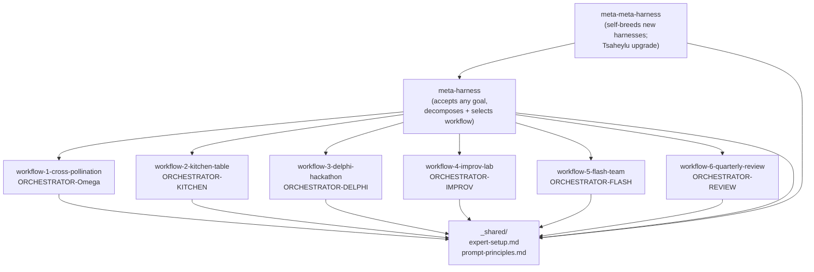

# Meta-Innovation Harness — Skills Index

This directory contains all Claude Code skill files for the **Meta-Innovation Harness**: a layered system for running multi-LLM "collective genius" research sessions. The Orchestrator (this Claude Code session) drives four frontier LLMs (Claude, ChatGPT, Gemini, Grok) through browser automation via the `mcp__claude-in-chrome__*` toolkit, applying blanking + leaking mechanics across nested loops.

---

## Layer Architecture



**Layers explained:**

- **Skills layer (W1–W6):** Six workflow skills, each encoding a distinct collaborative intelligence pattern. All share `_shared/expert-setup.md` (Phase 0 panel setup) and `_shared/prompt-principles.md` (P0–P5 prompt constraints).
- **Meta-skill layer (`meta-harness`):** Accepts an arbitrary GOAL, decomposes it into N tightly-coupled sub-questions, assigns expert lenses, selects the best-fit workflow, and runs the full session end-to-end.
- **Meta-meta-skill layer (`meta-meta-harness`):** Generates new harness variants, stress-tests existing harnesses, self-improves them, and hosts the optional Tsaheylu mythic-infusion upgrade.

---

## Workflow Selection Guide

| Workflow | Best For | Time Budget | Output Format | Outer Rounds | Key Superpower |
|----------|----------|-------------|---------------|--------------|----------------|
| **W1 — Cross-Pollination** | Maximum depth, frontier research, strong cross-domain interdependencies | Medium–High | Markdown research report | 4 | Purest blanking+leaking signal; no collaboration constraints |
| **W2 — Kitchen Table** | Elite-lab-style convergence; interconnected research programme feel | Medium–High | Research program + transactive map | 4 | TSM-CI (TMS/TAS/TRS) + "Yes-and" + commitment bet |
| **W3 — Delphi Hackathon** | Rapid landscape mapping; concrete deliverables needed fast | Medium (short per-loop budgets) | Grant abstracts + prototype experiments | 5 | Rotating Organizer + redundancy pruning + bridge questions |
| **W4 — Improv Lab** | Creative breakthrough; escaping local minima; radical reframing | Low | Theatrical dialogue script | 3 | Wild extensions (Wild1/2/3) + group flow energy |
| **W5 — Flash-Team** | Actionable roadmap; owner assignment; execution-ready plan | Medium | Ranked execution roadmap | 4 | Input obsession + grounding checks + ownership tracking |
| **W6 — Quarterly Review** | Polished whitepaper; adversarial stress-testing; leadership audience | High | Publication-ready whitepaper | 3 + 1 |Bottom-up creative + top-down adversarial board |
| **meta-harness** | Any goal; no workflow knowledge needed | Any | Workflow output + meta-analysis | Delegates to W1–W6 | Auto-decompose + auto-select + full orchestration |
| **meta-meta-harness** | Generate/critique/improve harnesses; Tsaheylu upgrade | High | New harness specs + critique reports | N/A | Self-breeding + Tsaheylu mythic-infusion |

---

## Decision Heuristic (Quick Reference)

```
Is time budget LOW?          → W4 (3 rounds) or W3 (5 short rounds)
Need ACTIONABLE ROADMAP?     → W5
Need WHITEPAPER / BOARD DECK? → W6
Stuck in LOCAL MINIMA?       → W4
Need STRESS-TESTING?         → W6
BREADTH mapping priority?    → W3
DEPTH + INTERDEPENDENCY?     → W1 or W2
TEAM CONVERGENCE feel?       → W2
Don't know which?            → meta-harness (it decides for you)
Want to BUILD a new harness? → meta-meta-harness
```

---

## Shared Foundations (do not modify)

| File | Purpose |
|------|---------|
| `_shared/expert-setup.md` | Phase 0: open tabs, set expert modes, verify, sanity ping |
| `_shared/prompt-principles.md` | P0 persona + P1–P5 constraints + canonical invocation template |

Every workflow skill's Phase 0 **defers entirely** to `_shared/expert-setup.md`. Every expert invocation uses the canonical template from `_shared/prompt-principles.md`.

---

## Archive Layout

Every run writes to `examples/{RUNID}/` following the schema in PRD Section 12. The RUNID format is `{YYYYMMDD}-{workflow}-{slug}`.

---

## Quick Start

1. Run the `meta-harness` skill with your GOAL — it handles everything.
2. Or invoke a specific workflow skill (W1–W6) if you know which pattern fits.
3. To generate a new harness variant or apply the Tsaheylu upgrade, use `meta-meta-harness`.
